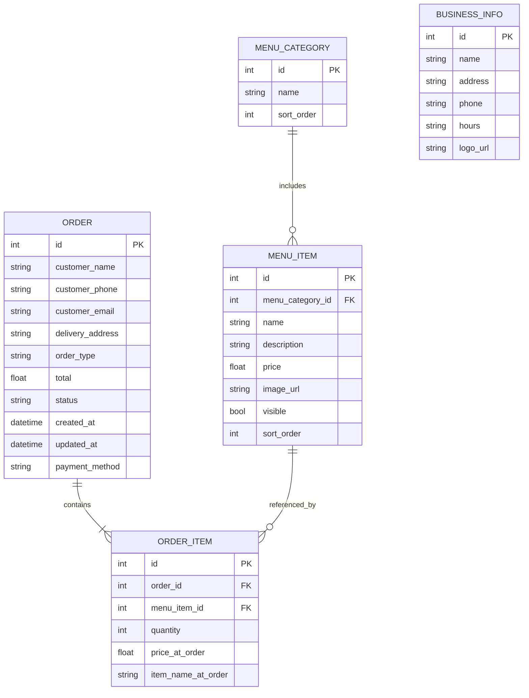

# Database Schema

---

## ER Diagram

<small>
**Note:** No authentication or login exists in this MVP. There are no user account, admin, or worker tables. There is only a single business instance.
</small>

---

## Description

### Entities

- **ORDER**  
  Represents a customer order. Captures guest customer details (name, phone, email, delivery address if delivery), order type (delivery/to-go), total, status (`new`, `accepted`, `rejected`, `ready`, etc.), payment method (stubbed), and timestamps. No customer account is required—orders are placed openly as guests.

- **ORDER_ITEM**  
  Line items for each order. Stores menu item reference, quantity, and the name/price at time of order, supporting historical accuracy even if menu changes.

- **MENU_CATEGORY**  
  Organizes menu items (e.g., Appetizers, Entrees) with a sort order for display.

- **MENU_ITEM**  
  Each menu offering, linked to a category. Includes basic item data, image, price, visibility, and sort order. No modifiers/options at this stage.

- **BUSINESS_INFO**  
  Stores all restaurant info (name, hours, address, phone, logo). Managed via the admin portal, and supports only a single business instance for this MVP.

### Relationships

- **ORDER → ORDER_ITEM**:  
  Each order contains multiple items (line items).

- **MENU_CATEGORY → MENU_ITEM**:  
  Categories group menu items for display and management.

- **ORDER_ITEM → MENU_ITEM**:  
  Each order item references the menu item for reporting and analytics.

### Example Scenario

A customer visits the digital menu, browses categories, and adds items to the cart. They provide their name, phone, and (if needed) delivery address at checkout—no login or registration required. Their order is saved as an ORDER, with ORDER_ITEM records for each menu item. The kitchen worker dashboard instantly displays the new order. The admin updates menu items and business hours via a web portal. There is no user authentication or multi-business functionality in this MVP.

### Extensibility

- **User Accounts & Authentication:**  
  Can be added later by introducing CUSTOMER, ADMIN_USER, and WORKER_USER tables.
- **Multi-Business Support:**  
  Can support multiple restaurants by adding a business_id to key tables.
- **Modifiers/Options, Analytics, Scheduled Orders:**  
  Future tables can be linked as requirements grow.

---

<small>
This schema is intentionally minimal to match MVP requirements and avoid confusion. There is no authentication, user registration, or access control in this phase. Only a single restaurant/business is supported.
</small>